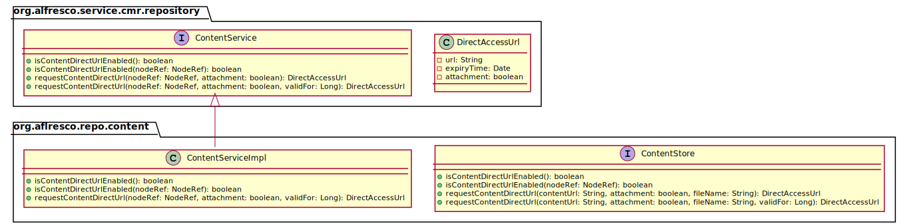
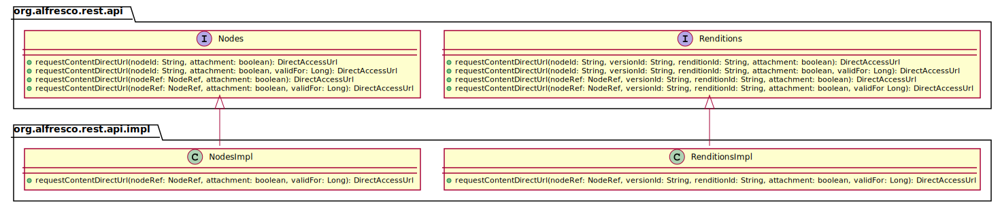
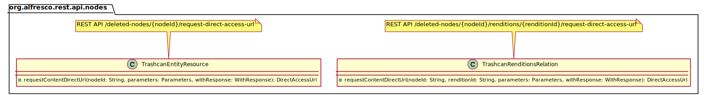
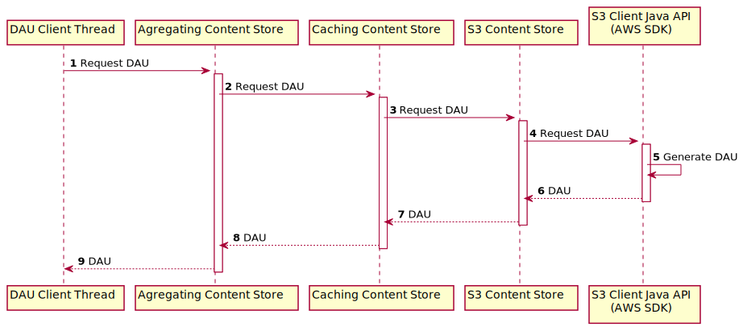
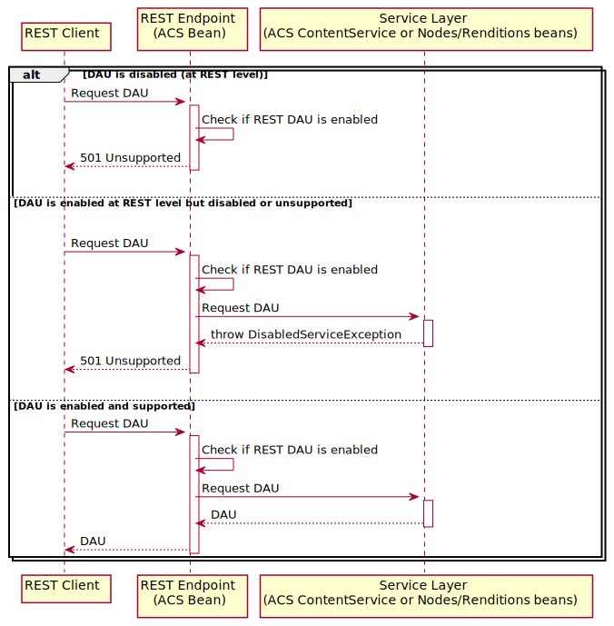

Direct Access Links (v2)
========================

Table of Contents
-----------------
  * [Related JIRAs](#related-jiras)
  * [Purpose](#purpose)
  * [Overview](#overview)
    * [Configurations](#configurations)
      * [System wide configuration (ACS)](#system-wide-configuration-acs)
      * [REST API configuration (ACS)](#rest-api-configuration-acs)
      * [Storage Connector Content Store (e\.g\. S3)](#storage-connector-content-store-eg-s3)
      * [Default Configuration](#default-configuration)
      * [Configuration priorities](#configuration-priorities)
    * [API](#api)
      * [REST Endpoints (ACS)](#rest-endpoints-acs)
        * [Open API Specs](#open-api-specs)
      * [Discovery API](#discovery-api)
      * [Java API](#java-api)
        * [ACS](#acs)
        * [Cloud Connector Base](#cloud-connector-base)
        * [S3 Connector](#s3-connector)
  * [Main flows](#main-flows)
    * [Enabling Direct Access URLs](#enabling-direct-access-urls)
    * [Service\-layer flows](#service-layer-flows)
      * [Generic Flow](#generic-flow)
        * [Caching Content Store](#caching-content-store)
        * [Aggregating Content Store](#aggregating-content-store)
      * [S3 Content Store](#s3-content-store)
      * [Multiple Content Stores](#multiple-content-stores)
      * [Encrypted stores](#encrypted-stores)
    * [REST API flow](#rest-api-flow)
    * [UI Client Integration example](#ui-client-integration-example)
  * [Security threats and controls](#security-threats-and-controls)
  * [Performance and scalability](#performance-and-scalability)


___
## Related JIRAs

* https://issues.alfresco.com/jira/browse/ACS-566
* https://issues.alfresco.com/jira/browse/ACS-595

___
## Purpose
The main purpose of the _Direct Access URLs_ is to accelerate the local download of content.

This feature would be useful both externally, to Alfresco Clients such as ADW clients (browser
clients), but also internally in the Alfresco ecosystem (e.g. the Alfresco Transformation
Services could benefit from fast and direct content downloads).

In order to leverage the fast/local download of content our client apps will need to be updated
to access content directly from our cloud providers (S3/Azure Connectors). This would also allow
us to profit from the CDN solution of the cloud provider (e.g. AWS CloudFront).

___
## Overview
AWS S3 provides a way of generating
[pre-signed URLs](https://docs.aws.amazon.com/AmazonS3/latest/dev/ShareObjectPreSignedURL.html)
for sharing objects. This feature is a perfect candidate for the implementation of direct
access to our content (e.g. shortcutting the Shared File Store for transformations or
faster/direct access in the context of ADW to documents).

>:warning: **Note:** The AWS S3 pre-signed URLs are temporary links with an expiration time.

The repository infrastructure must introduce support for direct access urls. The infrastructure
to back this must be built throughout the Alfresco platform. This includes the ContentService
and the ContentStore interface. We should still be able to work with ContentStore
implementations that implement the old version of this interface (e.g. provide default
implementations for new methods - should just throw a Not Supported exception).
Methods will be auditable (`@Auditable(parameters = {"nodeRef", "validFor"})`).

A new **Rest API endpoint** must be added in _Alfresco_ for requesting a new _Direct Access URL_ (a
direct download link) for a specific file in the Content Repository.

The access to _Direct URLs_ must be strictly controlled. Their expiration date should be
set/restricted by configurations in Alfresco Repository (global & content-store specific
properties). 


### Configurations

#### System wide configuration (ACS)
ACS system-wide configuration settings:
* **`system.content.directAccessUrl.enabled=false`**
    - Controls whether this feature is available, system wide.
    - For DAUs to work, the feature needs to be enabled both system-wide and on the individual
     content-store.
* **`system.content.directAccessUrl.defaultExpiryTimeInSec=30`**
    - Sets the default expiry time for the DAU across all Content Stores.
    - It’s value cannot exceed the system-wide max expiry time
    (`system.content.directAccessUrl.maxExpiryTimeInSec`), it can only be lower (_startup failure
    otherwise_).
    - This property is **mandatory** if DAUs are enabled (system-wide) - (_startup failure
    otherwise_).
* **`system.content.directAccessUrl.maxExpiryTimeInSec=300`**
    - Sets the upper limit for the DAUs expiry time, meaning a Content Store will be able to
    override this value but not exceed it, and the same goes for the clients. A service (Java
    Interface) client will be able to request a DAU for a custom expiry time but that time can’t
    exceed this value.
    - If the requested time exceeds the max value, the expiry time reverts to the default
    configured one.
    - This property is **mandatory** if DAUs are enabled (system-wide) - (_startup failure
    otherwise_).


#### REST API configuration (ACS)
The REST API configuration only affects the REST layer in ACS:
* **`alfresco.restApi.directAccessUrl.enabled=false`**
    - Enables/disables DAU requests via the REST API.
* **`alfresco.restApi.directAccessUrl.defaultExpiryTimeInSec=30`**
    - Sets the expiry time for all the DAU requested via a REST call (DAU REST API calls **cannot
    request** an explicit expiry time - unlike the service layer calls).
    - Its value cannot exceed the system-wide max expiry time configuration
    (`system.content.directAccessUrl.maxExpiryTimeInSec`), it can only be lower (_startup failure
    otherwise_).
    - If not set, the default system-wide setting will be used
    (`system.content.directAccessUrl.defaultExpiryTimeInSec`).


#### Storage Connector Content Store (e.g. S3)
Each content store (i.e. "_final_" content store, one that provides actual storage, as opposed to a
_caching content store_), should have dedicated configuration options:
* **`connector.s3.directAccessUrl.enabled=false`**
    - Controls whether DAUs are enabled on this specific content store.
* **`connector.s3.directAccessUrl.defaultExpiryTimeInSec=30`**
    - Sets the expiry time for the DAU in this store, by overriding the global config. If this
    value exceeds the content store limit (described below) or the global limit it should
    fallback to the global configuration.
    - Its value cannot exceed the system-wide max expiry time configuration
    (`system.content.directAccessUrl.maxExpiryTimeInSec`), it can only be lower (_startup failure
    otherwise_).
    - If not set, the default system-wide setting will be used
    (`system.content.directAccessUrl.defaultExpiryTimeInSec`).
* **`connector.s3.directAccessUrl.maxExpiryTimeInSec=300`**
    - The maximum expiry time interval that can be requested by clients - content-store specific
    setting.
    - Its value cannot exceed the system-wide configuration
    (`system.content.directAccessUrl.maxExpiryTimeInSec`), it can only be lower (_startup failure
    otherwise_).
    - If not set, the default system-wide setting will be used
    (`system.content.directAccessUrl.maxExpiryTimeInSec`).

>**Note:** Callers within the platform (i.e. Java interfaces) can either request a specific
> expiry time or rely on the default.

>**Note:** When multiple S3 buckets are used for storage in Alfresco, each S3 Content Stores can
> be configured with either the default (common) S3 Connector-specific properties (i.e.
> `connector.s3.directAccessUrl.enabled` & Co) OR new separate properties could be defined for
> each and every store (e.g. `connector.s3store1.directAccessUrl.enabled`,
> `connector.s3store2.directAccessUrl.enabled`, etc.).

    
#### Default Configuration
By default, Direct Access URLs are disabled. Meaning the following configuration properties
are **`false`**:
1. `system.content.directAccessUrl.enabled`
2. `alfresco.restApi.directAccessUrl.enabled`
3. `connector.s3.directAccessUrl.enabled`


#### Configuration priorities
For Direct Access URLs to be usable on the service-layer, the feature must be enabled both
_system-wide_ and on the content-store(s). For the feature to be usable through REST
(outside the JVM) the _rest-api configuration_ must also be enabled.

The `system.content.directAccessUrl.enabled` property is the main switch of the feature. If this is
set to false *ALL* Direct Access URLs are disabled.

The next configuration that controls specific Direct Access URLs is the content store one. The
`connector.s3.directAccessUrl.enabled` property controls whether Direct Access URLs are
enabled for that specific store.

Whether or not a client can request a Direct Access URL by using a REST endpoint is controlled by
the `alfresco.restApi.directAccessUrl.enabled` property. If the REST endpoint is disabled, but the
feature is enabled system-wide and on the content-store, then the direct access URLs will only
be usable by Java clients (only service-level requests will be possible).


### API
#### REST Endpoints (ACS)
Introduce multiple new endpoints in the Alfresco API which behave as per below specifications.
**Paths:**
* `/nodes/{nodeId}/request-direct-access-url`
* `/nodes/{nodeId}/renditions/{renditionId}/request-direct-access-url`
* `/nodes/{nodeId}/versions/{versionId}/request-direct-access-url`
* `/nodes/{nodeId}/versions/{versionId}/renditions/{renditionId}/request-direct-access-url`
* `/deleted-nodes/{nodeId}/request-direct-access-url`
* `/deleted-nodes/{nodeId}/renditions/{renditionId}/request-direct-access-url`
**Method:** **`POST`**
**Response:** Link to the resource wrapped in a JSON Object.
**Error Codes:**
* If there’s no Direct Access URL provider (e.g. Alfresco S3 Connector extension) installed in
Alfresco then returns **501** (HTTP Status Code). 
* Otherwise, use the same HTTP codes as the ones on:
[https://api-explorer.alfresco.com/api-explorer/#!/nodes/getNodeContent](https://api-explorer.alfresco.com/api-explorer/#!/nodes/getNodeContent)
**Parameters:**
* **`attachement`** - an optional flag which would control the download method (attachment URL vs
embedded URL). Defaults to `true` when not specified, meaning the value of the
[Content Disposition](https://developer.mozilla.org/en-US/docs/Web/HTTP/Headers/Content-Disposition)
response header will be `attachment`.
* The `filename` part of the
[Content Disposition](https://developer.mozilla.org/en-US/docs/Web/HTTP/Headers/Content-Disposition)
header will be set in the service layer logic and can't be controlled by the DAU client.

##### Open API Specs

```
  '/nodes/{nodeId}/request-direct-access-url':
    post:
      x-alfresco-since: "7.0.0"
      tags:
        - nodes
      summary: Generate a direct access content URL
      description: |
        **Note:** this endpoint is available in Alfresco 7.0 and newer versions.
        Generate a direct access content url for the given **nodeId**.
      operationId: requestNodeDirectAccessUrl
      parameters:
        - $ref: '#/parameters/nodeIdParam'
        - in: body
          name: requestContentUrlBodyCreate
          description: |
            Direct Access URL options and flags.

            It can be used to set the **attachment** flag, which controls the download method of
            the generated URL (attachment DAU vs embedded DAU). It defaults to **true**, meaning
            the value for the Content Disposition response header will be **attachment**.

            Note: It is up to the actual ContentStore implementation if it can fulfil this
            request or not.
          required: false
          schema:
            $ref: '#/definitions/DirectAccessUrlBodyCreate'
      produces:
        - application/json
      responses:
        '200':
          description: Successful response
          schema:
            $ref: '#/definitions/DirectAccessUrlEntry'
        '400':
          description: |
            Invalid parameter: **nodeId** is not a valid format, or is not a file
        '401':
          description: Authentication failed
        '403':
          description: Current user does not have permission for **nodeId**
        '404':
          description: |
            **nodeId** does not exist
        '501':
          description: The actual ContentStore implementation can't fulfil this request
        default:
          description: Unexpected error
          schema:
            $ref: '#/definitions/Error'

definitions:
  DirectAccessUrlBodyCreate:
    type: object
    properties:
      attachment:
        type: boolean
        description: URL type (embedded/attachment).
  DirectAccessUrlEntry:
    type: object
    required:
      - entry
    properties:
      entry:
        $ref: '#/definitions/DirectAccessUrl'
  DirectAccessUrl:
    type: object
    required:
      - contentUrl
    properties:
      contentUrl:
        type: string
        description: The direct access URL of a binary content
      expiresAt:
        type: string
        format: date-time
        description: The direct access URL would become invalid when the expiry date is reached
```

#### Discovery API

The Discovery API should provide status information about the Direct Access URLs feature
 (enabled/disabled).

A new field is required in its reply:
`RepositoryInfo > StatusInfo > isDirectAccessUrlEnabled`.

The new field should be **`true`** only when DAUs are enabled *system-wide* and DAUs are enabled on
the *REST API* and when if there is at least one ContentStore which supports and has DAUs enabled.

For the implementation, the `DiscoveryApiWebscript` should inject the `ContentService` bean
and make use of its `isContentDirectUrlEnabled` method.

#### Java API

##### ACS
New "`requestContentDirectUrl`" methods must be added in multiple classes involved in the DAU
request flow, with varying signatures (arguments) depending on the information
available/required at each step.







_PlantUML:_
```puml
@startuml
package org.alfresco.service.cmr.repository {
    class DirectAccessUrl {
        -url: String
        -expiryTime: Date
        -attachment: boolean
    }

    interface ContentService {
        {abstract} +isContentDirectUrlEnabled(): boolean
        {abstract} +isContentDirectUrlEnabled(nodeRef: NodeRef): boolean
        +requestContentDirectUrl(nodeRef: NodeRef, attachment: boolean): DirectAccessUrl
        {abstract} +requestContentDirectUrl(nodeRef: NodeRef, attachment: boolean, validFor: Long): DirectAccessUrl
    }
}
package org.aflresco.repo.content {
    class ContentServiceImpl {
        +isContentDirectUrlEnabled(): boolean
        +isContentDirectUrlEnabled(nodeRef: NodeRef): boolean
        +requestContentDirectUrl(nodeRef: NodeRef, attachment: boolean, validFor: Long): DirectAccessUrl
    }
    interface ContentStore {
        +isContentDirectUrlEnabled(): boolean
        +isContentDirectUrlEnabled(nodeRef: NodeRef): boolean
        +requestContentDirectUrl(contentUrl: String, attachment: boolean, fileName: String): DirectAccessUrl
        +requestContentDirectUrl(contentUrl: String, attachment: boolean, fileName: String, validFor: Long): DirectAccessUrl
    }
}
ContentService <|-- ContentServiceImpl
ContentServiceImpl -[hidden]> ContentStore

package org.alfresco.rest.api {
    interface Nodes {
        +requestContentDirectUrl(nodeId: String, attachment: boolean): DirectAccessUrl
        +requestContentDirectUrl(nodeId: String, attachment: boolean, validFor: Long): DirectAccessUrl
        +requestContentDirectUrl(nodeRef: NodeRef, attachment: boolean): DirectAccessUrl
        {abstract} +requestContentDirectUrl(nodeRef: NodeRef, attachment: boolean, validFor: Long): DirectAccessUrl
    }
    interface Renditions {
        +requestContentDirectUrl(nodeId: String, versionId: String, renditionId: String, attachment: boolean): DirectAccessUrl
        +requestContentDirectUrl(nodeId: String, versionId: String, renditionId: String, attachment: boolean, validFor: Long): DirectAccessUrl
        +requestContentDirectUrl(nodeRef: NodeRef, versionId: String, renditionId: String, attachment: boolean): DirectAccessUrl
        {abstract} +requestContentDirectUrl(nodeRef: NodeRef, versionId: String, renditionId: String, attachment: boolean, validFor Long): DirectAccessUrl
    }
}

package org.alfresco.rest.api.impl {
    class NodesImpl {
        +requestContentDirectUrl(nodeRef: NodeRef, attachment: boolean, validFor: Long): DirectAccessUrl
    }

    class RenditionsImpl {
        +requestContentDirectUrl(nodeRef: NodeRef, versionId: String, renditionId: String, attachment: boolean, validFor: Long): DirectAccessUrl
    }
}
Nodes <|-- NodesImpl
Renditions <|-- RenditionsImpl
Nodes -[hidden]> Renditions

package org.alfresco.rest.api.nodes {
    note top of NodesEntityResource: REST API /nodes/{nodeId}/request-direct-access-url
    class NodesEntityResource {
        +requestContentDirectUrl(nodeId: String, parameters: Parameters, withResponse: WithResponse): DirectAccessUrl
    }

    note top of NodeRenditionsRelation: REST API /nodes/{nodeId}/renditions/{renditionId}/request-direct-access-url
    class NodeRenditionsRelation {
        +requestContentDirectUrl(nodeId: String, renditionId: String, parameters: Parameters, withResponse: WithResponse): DirectAccessUrl
    }

    note top of NodeVersionRelation: REST API /nodes/{nodeId}/versions/{versionId}/request-direct-access-url
    class NodeVersionRelation {
        +requestContentDirectUrl(nodeId: String, versionId: String, parameters: Parameters, withResponse: WithResponse): DirectAccessUrl
    }

    note top of NodeVersionRenditionsRelation: REST API /nodes/{nodeId}/versions/{versionId}/renditions/{renditionId}/request-direct-access-url
    class NodeVersionRenditionsRelation {
        +requestContentDirectUrl(nodeId: String, versionId: String, parameters: Parameters, withResponse: WithResponse): DirectAccessUrl
    }

    note top of TrashcanEntityResource: REST API /deleted-nodes/{nodeId}/request-direct-access-url
    class TrashcanEntityResource {
        +requestContentDirectUrl(nodeId: String, parameters: Parameters, withResponse: WithResponse): DirectAccessUrl
    }

    note top of TrashcanRenditionsRelation: REST API /deleted-nodes/{nodeId}/renditions/{renditionId}/request-direct-access-url
    class TrashcanRenditionsRelation {
        +requestContentDirectUrl(nodeId: String, renditionId: String, parameters: Parameters, withResponse: WithResponse): DirectAccessUrl
    }
}
NodesEntityResource -[hidden]> NodeRenditionsRelation
NodeVersionRelation -[hidden]> NodeVersionRenditionsRelation
TrashcanEntityResource -[hidden]> TrashcanRenditionsRelation
@enduml
```

>**Note:** We could use a separate "**DirectAccessUrlOptions**" class/object for passing around
> DAU-specific options such as `validFor` and `attachment`. Such an object could also be later
> expanded (with new options/parameters) without breaking the existing APIs.

##### Cloud Connector Base
The only modification in Alfresco Cloud Connector Base is a new `requestContentDirectUrl` method
on the **ServiceAdapter** interface, which should have a default implementation with an exception
thrown.

The **BaseContentStore** does not support Direct Access URLs, and it needs no extra
modifications, as that behaviour is already covered by the default implementation of the
ContentStore interface (in ACS).


_PlantUML:_


##### S3 Connector


_PlantUML:_


The [AWS Java S3 SDK](https://docs.aws.amazon.com/AmazonS3/latest/dev/ShareObjectPreSignedURLJavaSDK.html)
must be used to generate the pre-signed direct access URLs with the configured duration (see
Repository and Content Store expiry times configurations).

The pre-signed request should generate a download for the remote content with the right file name,
content type and extension. See [ACS-415](https://alfresco.atlassian.net/browse/ACS-415). 

>**Known Limitations:** DAU generation on S3 depends on the security credentials used:
> https://docs.aws.amazon.com/AmazonS3/latest/dev/ShareObjectPreSignedURL.html

___
## Main flows

### Enabling Direct Access URLs
In order to be able to request a Direct Access URLs 3 configurations must be set to **`true`**:
1. `system.content.directAccessUrl.enabled` (system wide)
2. `alfresco.restApi.directAccessUrl.enabled` (for enabling REST calls)
3. `connector.s3.directAccessUrl.enabled` (specific to a store)


### Service-layer flows
#### Generic Flow


_PlantUML:_


##### Caching Content Store
_Code snippet:_
```java
    public boolean isDirectAccessSupported()
    {
        return backingStore.isDirectAccessSupported();
    }

    public DirectAccessUrl getDirectAccessUrl(String contentUrl, Date expiresAt)
    {
        return backingStore.getDirectAccessUrl(contentUrl, expiresAt);
    }
```

##### Aggregating Content Store
_Code snippet:_
```java
    /**
     * @return Returns <tt>true</tt> if at least one store supports direct access
     */
    public boolean isDirectAccessSupported()
    {
        // Check the primary store
        boolean isDirectAccessSupported = primaryStore.isDirectAccessSupported();

        if (!isDirectAccessSupported)
        {
            // Direct access is not supported by the primary store so we have to check the
            // other stores
            for (ContentStore store : secondaryStores)
            {

                isDirectAccessSupported = store.isDirectAccessSupported();

                if (isDirectAccessSupported)
                {
                    break;
                }
            }
        }

        return isDirectAccessSupported;
    }

    public DirectAccessUrl getDirectAccessUrl(String contentUrl, Date expiresAt)
    {
        if (primaryStore == null)
        {
            throw new AlfrescoRuntimeException("ReplicatingContentStore not initialised");
        }

        // get a read lock so that we are sure that no replication is underway
        readLock.lock();
        try
        {
            // Keep track of the unsupported state of the content URL - it might be a rubbish URL
            boolean contentUrlSupported = true;
            boolean directAccessUrlSupported = true;

            DirectAccessUrl directAccessUrl = null;

            // Check the primary store
            try
            {
                directAccessUrl = primaryStore.getDirectAccessUrl(contentUrl, expiresAt);
            }
            catch (UnsupportedOperationException e)
            {
                // The store does not support direct access URL
                directAccessUrlSupported = false;
            } 
            catch (UnsupportedContentUrlException e)
            {
                // The store can't handle the content URL
                contentUrlSupported = false;
            }

            if (directAccessUrl != null)
            {
                return directAccessUrl;
            }

            // the content is not in the primary store so we have to go looking for it
            for (ContentStore store : secondaryStores)
            {
                try
                {
                    directAccessUrl = store.getDirectAccessUrl(contentUrl, expiresAt);
                }
                catch (UnsupportedOperationException e)
                {
                    // The store does not support direct access URL
                    directAccessUrlSupported = false;
                }
                catch (UnsupportedContentUrlException e)
                {
                    // The store can't handle the content URL
                    contentUrlSupported = false;
                }

                if (directAccessUrl != null)
                {
                    break;
                }
            }

            if (directAccessUrl == null)
            {
                if (!directAccessUrlSupported)
                {
                    // The direct access URL was not supported
                    throw new UnsupportedOperationException("Retrieving direct access URLs is not supported by this content store.");
                }
                else if (!contentUrlSupported)
                {
                    // The content URL was not supported
                    throw new UnsupportedContentUrlException(this, contentUrl);
                }
            }

            return directAccessUrl;
        }
        finally
        {
            readLock.unlock();
        }
    }
```

#### S3 Content Store



_PlantUML:_


#### Multiple Content Stores
When multiple content stores are configured in ACS, the DAU feature can be enabled/disabled
individually on each store (provided it supports DAUs).

#### Encrypted stores
Not supported.

### REST API flow
The REST API endpoint methods will always call the service layer with the default REST expiry
time (`alfresco.restApi.directAccessUrl.defaultExpiryTimeInSec`). The service layer will decide
whether the expiry time must be reduced (for instance when the content store max expiry time is
lower).



_PlantUML:_


### UI Client Integration example
For downloading a file from ACS, a client application could implement a logic that first attempts
to retrieve (and use) a Direct Access Link (".../request-direct-access-url" endpoint) and if that
fails, it could default to using the standard Alfresco REST API (".../content" endpoints).  


_PlantUML:_


>**Note:** Browser client apps imply that CORS rules must be configured on the S3 bucket so that
> cross-site requests from the client app domain to S3 are allowed. 

___
## Security threats and controls
Once generated, the pre-signed URLs can be used by anyone that obtains them (either within or
outside Alfresco).

The Direct Access URLs have an expiry time, but they can’t be invalidated prior to that expiry
time.

The expiration date is restricted through Alfresco configurations (global & content-store
specific properties).

Once started, a long-running download will continue even though the Direct URL might expire
before the download finishes.

If Alfresco Repository uses (is configured with) multiple content stores, then the DAU feature
can be enabled on only one (or a subset) of those content stores.

___
## Performance and scalability
Each call to one of the new `.../request-direct-access-url` Alfresco REST endpoints results in the
creation of a new (and separate) pre-signed URL for an AWS S3 object.

The generation of a pre-signed URL is a purely AWS SDK **client-side operation** - meaning the
URL is generated (&signed) locally in the Alfresco JVM, without any communication with AWS
(no I/O). This also implies that generating an S3 pre-signed URL results in
[no extra AWS costs](https://stackoverflow.com/questions/55231229/does-generating-a-pre-signed-url-to-an-s3-object-using-the-aws-sdk-cost-anything).

The Direct Access URL generation is a fairly simple and quick operation, not particularly
computation-intensive (though it does involve a small cryptographic operation - the generated
URLs are signed with the AWS credentials).

It’s best if client applications request a DAU right before the actual download operation, or
only after the intention of using the DAU is certain.
Client applications should avoid generating DAUs for Alfresco content proactively, when the
actual file download is unlikely to happen - especially if a large set of files is involved.

>**Note:** Before generating a DAU we must check that the Node in Alfresco has content (e.g. it
> must be an actual file with content, not a folder or a site).

___
