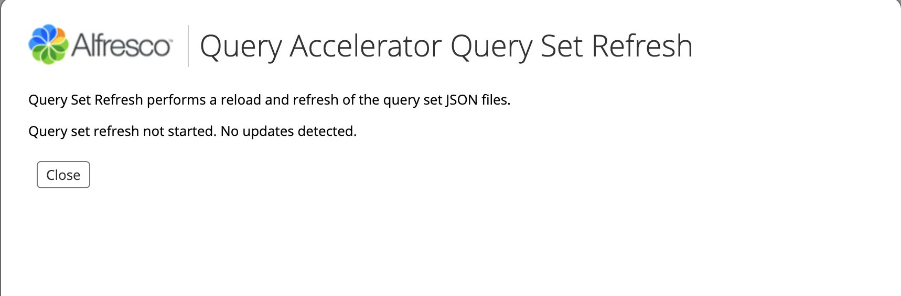

# Query Accelerator - First Draft

* PRODMAN : https://alfresco.atlassian.net/browse/PRODMAN-174
* EPIC : https://alfresco.atlassian.net/browse/ACS-247

## Description

An administrator may define [zero or more] "query sets" of properties, document types or aspects applied to nodes to 
support faster queries. Properties may be from multiple types or aspects. Queries that currently go to either Solr or 
TMDQs that only use values in one of these query sets will be directed to a new "query accelerator" which will perform 
the query against a denormalised table.

This comes at the cost of additional space for the denormalised relational tables and indexes as well as a minimal 
increased time on ingestion and updates to support the denormalisation. This will however allow customers to make that 
decision. Typically we would only suggest using this feature to support large transactional deployments, where documents 
are automatically imported form other systems, rather than traditional collaborative content management system where 
humans are creating documents. In transactional deployments there typically is a case id and one or two other properties, 
which identify a related collection of documents. These properties would be a good candidate for a query set in the new 
"query accelerator". Having many properties in a query set or lots of query sets should be avoided, as the cost will be 
high and generally indicates that there is something wrong with the data model design.

### Operational and project requirements

1. Query sets may be applied to an existing Alfresco repository. For example a query set could be applied to a system 
which has been upgraded to 7.0.0 that already contains hundreds of million documents.

2. Multiple (zero or more but typically not more than 10) query set may be defined. Each will have its own name. It will 
be possible to replace a query set with an new version or to remove it completely. The definition can include the 
properties, document type or aspects applied to nodes and if necessary (for selected databases) the order of columns 
in compound indexes. The implementation will use one or more JSON files to define the query sets.

3. The addition of new query sets, the replacement of an existing query set or complete removal will not require a 
restart, an outage or have a major impact on normal operations. The alfresco.log will contain INFO messages to reflect 
progress. The implementation will need to identify that a new query set exist and to start populating a denormalised 
table in background. It will also need to be able to abandon the table population before it is complete, if a new 
version of the query set is created or the query set is removed. The implementation will also need to identify a query 
set or a previous version is no longer needed and trigger the removal of the denormalised table in background.

4. Once the denormalised table has been created and fully populated, it will automatically start being used.

5. The Query accelerator will provide ATOMIC (transactionally consistent) results. This is only possible if we include 
maintaining denormalised tables as part of the main transaction used to update our normal database tables. This will 
have a higher cost on the normal operation of the repository than a system that only promises to be eventually 
consistent, but will be simpler to implement, maintain and use in more situations.

6. The query accelerator is an enterprise edition feature.


## Alfresco Query Accelerator Properties

* Enable the Query Accelerator by setting the property alfresco.queryAccelerator.enabled to true.
* Define the location of the Query Accelerator configs by setting the property alfresco.queryAccelerator.config.path
* Wait time after system startup before populating the tables. Default value is 60
* The size of each population batch. Default value is 250000

### Properties example
```
alfresco.queryAccelerator.enabled=true
alfresco.queryAccelerator.config.path=alfresco/queryaccelerator
alfresco.queryAccelerator.populator.startDelayMinutes=3
alfresco.queryAccelerator.populator.workerBatchSize=250000
```


## Query Set Configs

The query set configurations define the denormalized tables that will be created to supported the TMDQs.

### Query set configuration example

```json
{
  "version": "1",
  "tableName": "rqa_name_desc",
  "properties": [
    {
      "name": "cm:name",
      "isIndex": true
    },
    {
      "name": "cm:description",
      "isIndex": true
    }
  ],
  "aspects": [
    {
      "name": "cm:titled",
      "isIndex": true
    }
  ],
  "type": {
      "name": "cm:content",
      "isIndex": true
  },
  "compositeIndexes": {
    "index_1": ["cm:name", "cm:description"],
    "index_2": ["cm:name", "cm:titled"]
  }
}
```

### Query set configuration

| Attribute        | Description |
| ---------------- | ----------- |
| version          | The version of the query set. |
| tableName        | The table name. The actual database table name will have a prefix of 'alf_qs_' and a suffix of '_v' plus the version. So for a tableName of 'rqa_name_desc' and a version of 1 that actual database table name would be 'alf_qs_rqa_name_desc_v1'. |
| properties       | A collection of properties to appear on the denormalised table. A property consists of a name attribute which is the QName of a property and an isIndex attribute which indicates that the related column on the table should be indexed.            |
| aspects          | A collection of aspects to appear on the denormalised table. The table will have a boolean column for each of the aspects to indicate if the node has those aspects applied. An aspect consists of a name attribute which is the QName of an aspect and an isIndex attribute which indicates that the related column on the table should be indexed. |
| type             | The type of nodes to be stored on the denormalised table. The type consists of a name attribute which is the QName of the of a type and an isIndex attribute which indicates that the related column on the table should be indexed. The database column on the table for storing the type will be called cm_type and the column for each row will be the type QName.           |
| compositeIndexes | A collection of composite indexes to be created for the table. A composite index consists of an attribute where the attribute name is the index name and the attribute value is a collection of QNames of properties and/or aspects of the query set. |

### Updating and replacing query sets

#### Removing a query set

You can remove a query set by removing the query set JSON file from the configuration path and then request a query set 
refresh in the Admin Tools. (see Query set refresh in Admin Tools)

During the refresh the JSON config files will be compared against the internal registry of query sets. If a query set in 
the registry does not have a corresponding JSON config file with the same tableName then the query set will be removed 
from the registry and the denormalised database table will be dropped. 

#### Updating a query set

You can update/replace a query set by changing the properties, aspects, type and compositeIndexes in the query set JSON config.

You then need to update the version in the query set JSON config and then request a query set refresh in the Admin Tools. 
(see Query set refresh in Admin Tools)

This will start a process that will replace the previous version of the query set.
* A new version of the query set will be added to the internal query set registry.
* A new version of the denormalised table will be created.
* The denormalised table for the previous version will continue to exist until it has been replaced by the new version.
* The new version of the denormalised table will be populated. This could take a considerable time depending on the scale 
of the Alfresco installation.
* When the population is completed
    * the query set will be flagged as live 
    * the previous version of the query set will be removed from the internal registry
    * the denormalised table for the previous version will be dropped

#### Important

If you edit a query set JSON config and change the tableName and request a query set refresh this will look to the 
system that you have removed the original query set and created a new query set. This will result in the original query 
set being removed from the registry and the denormalised table being dropped before the denormalised table for the new 
query set is ready to use.  


#### Query Set Refresh in Alfresco Administration Console

The query sets can be refreshed in the Alfresco Administration Console in Share.

1 Select 'Search Service' in the left hand menu.


2 Scoll down to the 'Relational Query Accelerator' section. 


3 Press the 'Refresh Query Set' button. 

If there are updates to the query sets you will see:


If there are no updates to the query sets you will see:



## How to set-up the Query Accelerator for a new Alfresco installation

1. Set the query accelerator properties to enable the query accelerator and set the config path directory.

2. Place one or more query set JSON config files in the query accelerator config path directory.

3. Start the new installation of Alfresco.

4. The denormalised tables will be created and populated by the end of the installation startup.


## How to set-up the Query Accelerator for an existing Alfresco installation

1. Set the query accelerator properties to enable the query accelerator and set the config path directory.

2. Place one or more query set JSON config files in the query accelerator config path directory.

3. Restart Alfresco so that the new properties are used.

4. Start a Query Set Refresh in the Alfresco Administration Console as described earlier.

5. The denormalised tables will be created

6. The population of the denormalised tables might take a considerable time depending on the scale of the alfresco
installation. The progress of the population of the table will be output to the alfresco log.

7. TODO: How does a user know when a table is fully populated and live?


## Query Sets and Transaction Meta-Data Queries (TMDQ)

Here we give an example of how to create a Query Set for a TMDQ.

The following TMDQ selects all documents (cm:content) which have a dublincore aspect (cm:dublincore) and has a 
publisher (cm:publisher) equal to 'Hachette Livre' and a type (cm:type) equal to 'Action'.

```
{
   "query":{
      "query":"select * from cmis:document as d join cm:dublincore as dc on d.cmis:objectId = dc.cmis:objectId where dc.cm:publisher = 'Hachette Livre' and dc.cm:type='Action'",
      "language":"cmis"
   }
}
```

The following Query Set would be able to support the above TMDQ.

```json
{
  "version": "1",
  "tableName": "doc_dublincore",
  "properties": [
    {
      "name": "cm:publisher",
      "isIndex": true
    },
    {
      "name": "cm:type",
      "isIndex": true
    }
  ],
  "aspects": [
    {
      "name": "cm:dublincore",
      "isIndex": true
    }
  ],
  "type": {
      "name": "cm:content",
      "isIndex": true
  }
}
```


## Query Set Status and Caching

Each table version has one status, i.e. a table could have:
tableA, version 1, OBSOLETE
tableA, version 2, LIVE
tableA, version 3, INPROGRESS
tableA, version 4, NEW

Each status should only appear at most most for a given table, i.e. a table cannot have two “LIVE” versions.
The transition from NEW to INPROGRESS would normally happen almost immediately.
The query set cache contains all versions including obsolete and in-progress versions. This is to allow the “maintain table population” process to begin without having to wait for the initial table population to complete.

Use case scenarios:

Scenario 1: Add new table: tableA, v1 (no previous versions)
|                          |   Registry and cache       |                      DB |
| ------------------------ | :------------------------: | ----------------------: |
| Before refresh:          |          empty             |                No table |
| After refresh            | tableA, V1, NEW-INPROGRESS | V1 Created & populating |
| After table populated    | tableA, V1, NEW-INPROGRESS |            V1 Populated |
| After activate query set |    tableA, V1, LIVE        |            V1 Populated |

Scenario 2a: Delete table: tableA (INPROGRESS)
|                          |   Registry and cache       |                           DB |
| ------------------------ | :------------------------: | ---------------------------: |
| Before refresh:          | tableA, V1, NEW-INPROGRESS |      V1 Created & populating |
| After refresh            |  tableA, V1, OBSOLETE      | V1 Stop population requested |
| After population aborted |          empty             |           V1 Dropped from DB |

Scenario 2b: Delete table: tableA (LIVE)
|                 | Registry and cache |                 DB |
| --------------- | :----------------: | -----------------: |
| Before refresh: |  tableA, V1, LIVE  |       V1 Populated |
| After refresh   |        empty       | V1 Dropped from DB |

Scenario 2c: Delete table: tableA (Multiple versions)
|                          |   Registry and cache       |                           DB |
| ------------------------ | :------------------------: | ---------------------------: |
| Before refresh:          |    tableA, V1, LIVE        |      V1 Created & populating |
|                          | tableA, V2, NEW-INPROGRESS |      V2 Created & populating |
| After refresh            |  tableA, V2, OBSOLETE      |           V1 Dropped from DB |
|                          |                            | V2 Stop population requested |
| After population aborted |          empty             |           V2 Dropped from DB |

Scenario 3a: Upgrade table: tableA to V2 (previous version INPROGRESS)
|                          |   Registry and cache       |                           DB |
| ------------------------ | :-------------------------:| ---------------------------: |
| Before refresh:          | tableA, V1, NEW-INPROGRESS |      V1 Created & populating |
| After refresh            |  tableA, V1, OBSOLETE      | V1 Stop population requested |
|                          | tableA, V2, NEW-INPROGRESS |      V2 Created & populating |
| After population aborted | tableA, V2, NEW-INPROGRESS |           V1 Dropped from DB |
| After table populated    | tableA, V2, NEW-INPROGRESS |                 V2 Populated |
| After activate query set |    tableA, V2, LIVE        |                 V2 Populated |

NB: population aborted and population completed could happen in any order

Scenario 3b: Upgrade table: tableA to V2 (previous version LIVE)
|                          |   Registry and cache       |                      DB |
| ------------------------ | :------------------------: | ----------------------: |
| Before refresh:          |    tableA, V1, LIVE        |            V1 Populated |
| After refresh            |    tableA, V1, LIVE        |            V1 Populated |
|                          | tableA, V2, NEW-INPROGRESS | V2 Created & populating |
| After table populated    |    tableA, V1, LIVE        |            V1 Populated |
|                          | tableA, V2, NEW-INPROGRESS |            V2 Populated |
| After activate query set |    tableA, V2, LIVE        |      V1 Dropped from DB |
|                          |                            |            V2 Populated |

Scenario 3c: Upgrade table: tableA to V3 (previous versions LIVE and INPROGRESS)
|                          |   Registry and cache       |                           DB |
| ------------------------ | :------------------------: | ---------------------------: |
| Before refresh:          |    tableA, V1, LIVE        |                 V1 Populated |
|                          | tableA, V2, NEW-INPROGRESS |      V2 Created & populating |
| After refresh            |    tableA, V1, LIVE        |                 V1 Populated |
|                          |  tableA, V2, OBSOLETE      | V2 Stop population requested |
|                          | tableA, V3, NEW-INPROGRESS |      V3 Created & populating |
| After population aborted |    tableA, V1, LIVE        |                 V1 Populated |
|                          | tableA, V3, NEW-INPROGRESS |           V2 Dropped from DB |
|                          |                            |      V3 Created & populating |
| After table populated    |    tableA, V1, LIVE        |                 V1 Populated |
|                          | tableA, V3, NEW-INPROGRESS |                 V3 Populated |
| After activate query set |    tableA, V3, LIVE        |           V1 Dropped from DB |
|                          |                            |                 V3 Populated |


## Logging

The admin console only informs whether updates were detected. For a more complete picture of the query sets configuration DEBUG logging must be used:
```
log4j.logger.org.alfresco.enterprise.repo.queryaccelerator.QuerySetConfigServiceImpl=debug
log4j.logger.org.alfresco.enterprise.repo.queryaccelerator.QuerySetConfigFileFinder=debug
log4j.logger.org.alfresco.enterprise.repo.queryaccelerator.QuerySetRegistryImpl=debug
```
INFO messages should give a % based on number of nodes at the start vs number of nodes processed so far. Log message should look something like: [INFO] {denorm tablename} 25% completed

## Notes

* The maximum length of the tableName and the version is the maximum table name length of the database system being used 
mimus 9. So for Postgres that has a maximum table name length of 63 bytes the maximum tableName and version length in 
the query set is 54 bytes.
* Queries that present negations on aspects should not be accelerated.
* Properties of type MLTEXT will NOT be supported. If any such properties are detected in the definition of a QuerySet then a WARN message will be issued,
the properties will be ignored and the corresponding denormalised table will be created without them.