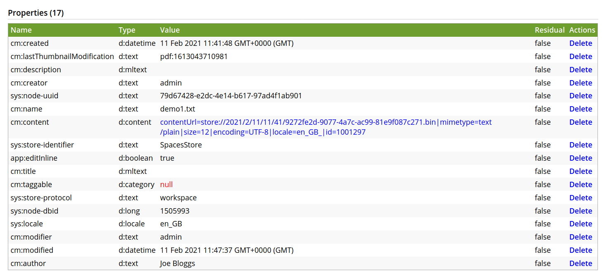
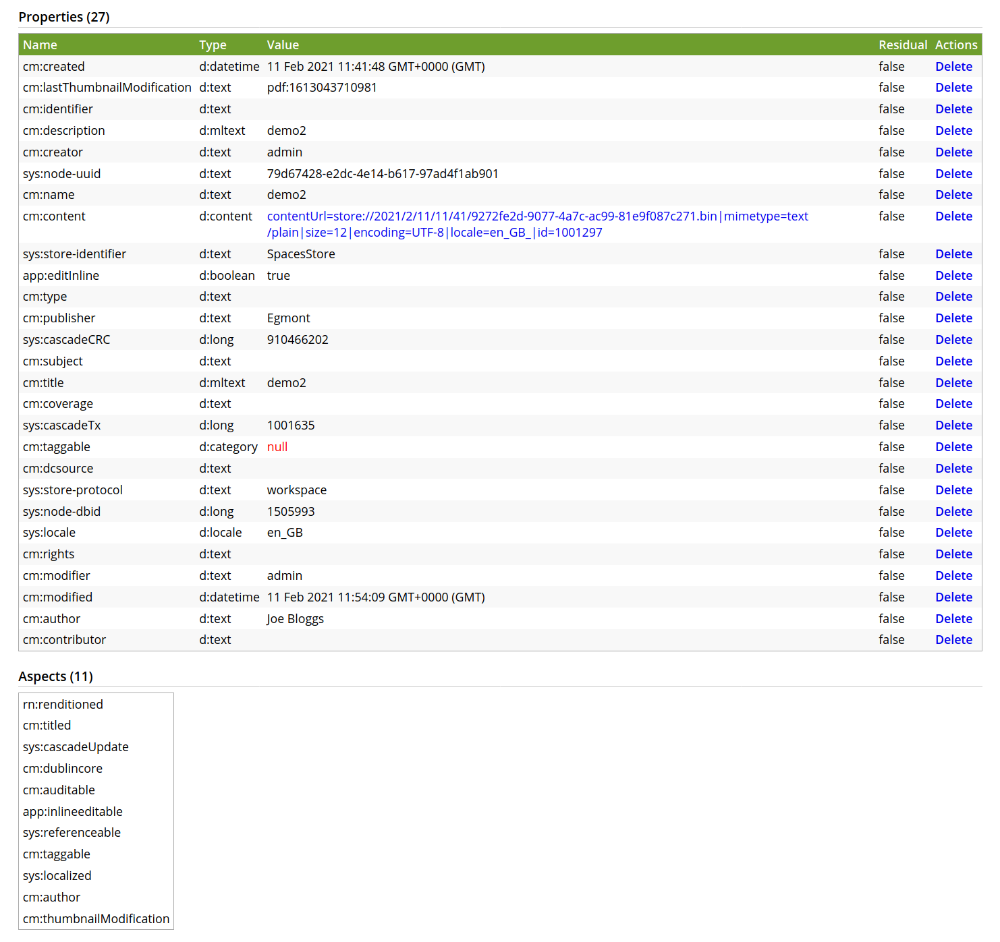
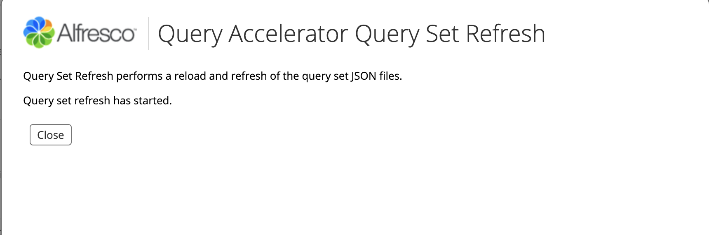

# Query Accelerator

## Description

The Query Accelerator is a mechanism for optimising selected queries in very large content repositories. We would
suggest using this feature to support large transactional deployments with hundreds of millions of nodes, where
documents are automatically imported from other systems, rather than traditional collaborative content management
system where humans are creating documents. In transactional deployments there typically is a case id and one or two
other properties, which identify a related collection of documents.

An administrator may define a combination of properties and aspects as a `query set`, to support a faster alternative to
TMDQ (Transactional MetaData Query) or Solr. Properties may be from multiple types or aspects. A single query set can
speed up more than on query if the queries share common search properties or aspects. A number of different query sets
may be created to support queries with different search properties or aspects.

This performance comes at the cost of additional space for denormalized databases tables and indexes as well as a minimal 
increased time on ingestion and update. This will however allow customers to make that decision. Having many properties
in a query set or having lots of query sets should be avoided, as the cost will be high and generally indicates that
there is something wrong with the data model design.

### Operational requirements

1. Query sets may be applied to an existing Alfresco repository. For example a query set could be applied to a system
which has been upgraded to 7.0.0 that already contains hundreds of millions of documents.

2. Multiple (zero or more but typically not more than 10) query sets may be defined. Each will have its own name. It will
be possible to replace a query set with a new version or to remove it completely. The definition can include the
properties or aspects applied to nodes and if necessary (for selected databases) the order of columns
in compound indexes. Query sets are defined using JSON files.

3. The addition of new query sets, the replacement of an existing query set or complete removal does not require a 
restart, an outage or have a major impact on normal operations. The alfresco.log will contain messages to reflect 
progress. When a new query set is identified, the system will start populating a denormalized 
table in background. It will also abandon the table population before it is complete, if a new 
version of the query set is created or the query set is removed. The implementation will also need to identify a query 
set or a previous version is no longer needed and trigger the removal of the denormalised table in background.

4. Once a denormalized table has been created and fully populated, it will automatically start being used.

5. The Query accelerator will provide ATOMIC (transactionally consistent) results.

6. The query accelerator is only an enterprise edition feature.


## Alfresco Query Accelerator Properties

* Enable the Query Accelerator by setting the property queryAccelerator.enabled to true.
* Define the location of the Query Accelerator config files by setting the property queryAccelerator.config.path
* Wait time after system startup before populating the tables. Default value is 60
* The size of each population batch. Default value is 250000

### Properties example
```
queryAccelerator.enabled=true
queryAccelerator.config.dir=shared/classes/alfresco/extention/querysets
queryAccelerator.populator.startDelayMinutes=3
queryAccelerator.populator.workerBatchSize=250000
```

### Query set configuration

The query set configurations define the denormalized tables that will be created to support faster queries.

| Attribute        | Description |
| ---------------- | ----------- |
| version          | The version of the query set. |
| name             | The table name. The actual database table name will have a prefix of 'alf_qs_' and a suffix of '_v' plus the version. So for a query set called of 'Test1' and a version of 1 that actual database table name would be 'alf_test1_desc_v1'. |
| properties       | A collection of properties to appear on the denormalized table. A property consists of a name attribute which is the name of a property and an isIndex attribute which indicates that the related column on the table should be indexed.            |
| aspects          | A collection of aspects to appear on the denormalized table. The table will have a boolean column for each of the aspects to indicate if the node has those aspects applied. An aspect consists of a name attribute which is the name of an aspect and an isIndex attribute which indicates that the related column on the table should be indexed. |
| compositeIndexes | A collection of composite indexes to be created for the table. A composite index consists of an attribute where the attribute name is the index name and the attribute value is a collection of names of properties and/or aspects of the query set. |

* The maximum length of the query set name and the version is the maximum table name length of the database system being used,
  mimus 9. So for Postgres, which has a maximum table name length of 63 bytes, the maximum name and version length in
  the query set is 54 bytes.
* Queries that include negations on aspects should not be accelerated.
* Properties of type MLTEXT are NOT be supported. If any such properties are detected, a WARN message will be logged,
  the properties will be ignored and the corresponding denormalized table will be created without them.
* The denormalized table will have an alf_type column, holding the name of the content type.


### Query set configuration examples

### Example 1

```json
{
  "version": 1,
  "name": "Test01",
  "properties": [
    {
      "name": "cm:name",
      "isIndex": true
    },
    {
      "name": "cm:creator",
      "isIndex": true
    }
  ],
  "aspects": [
    {
      "name": "cm:titled",
      "isIndex": true
    }
  ],
  "compositeIndexes": {
    "index_1": ["cm:name", "cm:creator"],
    "index_2": ["cm:name", "cm:titled"]
  }
}
```
ACS node properties:

Table entry:

| node_id | owner_id | alf_type | cm_name   | cm_creator | cm_titled |
| ------- | -------- | -------- | --------- | ---------- | --------- |
| 887     | 3        | 24       | demo1.txt | admin      | true      |


### Example 2

```json
{
  "version": 6,
  "name": "ac",
  "properties": [
    {
      "name": "cm:name",
      "isIndex": true
    },
    {
      "name": "cm:creator",
      "isIndex": true
    }
  ],
  "aspects": [
    {
      "name": "cm:titled",
      "isIndex": true
    },
    {
      "name": "cm:dublincore",
      "isIndex": true
    }
  ],
  "compositeIndexes": {
    "index_1": ["cm:name", "cm:creator"],
    "index_2": ["cm:name", "cm:titled"]
  }
}
```
ACS node properties and aspects:

Table entry:

| node_id | owner_id | alf_type | cm_name   | cm_creator | cm_titled | cm_dublincore |
| ------- | -------- | -------- | --------- | ---------- | --------- | ------------- |
| 918     | 3        | 24       | demo2.txt | admin      | true      | true          |

  
### Updating and replacing query sets

#### Removing a query set

You can remove a query set by removing the query set JSON file from the configuration path and then request a query set
refresh in the Alfresco Administration Console.

During the refresh the JSON config files will be compared against the internal registry of query sets. If a query set in
the registry does not have a corresponding JSON config file with the same tableName then the query set will be removed
from the registry and the denormalized database table will be dropped. 

#### Updating a query set

You can update/replace a query set by changing the properties, aspects and compositeIndexes in the query set JSON config.

You then need to update the version in the query set JSON config and then request a query set refresh in the
Alfresco Administration Console.

This will start a process that will replace the previous version of the query set.
* A new version of the query set will be added to the internal query set registry.
* A new version of the denormalized table will be created.
* The denormalized table for the previous version will continue to exist until it has been replaced by the new version.
* The new version of the denormalized table will be populated. This could take a considerable time depending on the scale 
of the Alfresco installation.
* When the population is completed
    * the query set will be flagged as live
    * the previous version of the query set will be removed from the internal registry
    * the denormalized table for the previous version will be dropped

#### Important

If you edit a query set config and change the name and request a query set refresh, the system will see this 
as the removal of the original query set and the creation of a new one. It will result in the original query 
set being removed from the registry and the denormalized table being dropped before the denormalized table for the new 
query set is ready to use.


#### Query Set Refresh in Alfresco Administration Console

The query sets can be refreshed in the Alfresco Administration Console.

1 Select 'Search Service' in the left hand menu.


2 Scoll down to the 'Query Accelerator' section.


3 Press the 'Refresh Query Set' button.

If there are updates to the query sets you will see:



If there are no updates to the query sets you will see:


## How to set-up the Query Accelerator for a new Alfresco installation

1. Set the query accelerator properties to enable the query accelerator and set the config path directory.

2. Place one or more query set JSON config files in the query accelerator config path directory.

3. Start the new installation of Alfresco.

4. The denormalized tables will be created and populated by the end of the installation startup.


## How to set-up the Query Accelerator for an existing Alfresco installation

1. Set the query accelerator properties to enable the query accelerator and set the config path directory.

2. Place one or more query set JSON config files in the query accelerator config path directory.

3. Restart Alfresco so that the new properties are used.

4. Start a Query Set Refresh in the Alfresco Administration Console as described earlier.

5. The denormalized tables will be created

6. The population of the denormalized tables might take a considerable time depending on the scale of the alfresco
installation. The progress of the population of the table will be output to the alfresco log.


## Query Sets and Transaction Meta-Data Queries (TMDQ)

Here we give an example of how to create a Query Set to replace a TMDQ.

The following TMDQ selects all documents (cm:content) which have a dublincore aspect (cm:dublincore), a
publisher (cm:publisher) equal to 'Hachette Livre' and a type (cm:type) equal to 'Action'.

```
{
   "query":{
      "query":"select * from cmis:document as d join cm:dublincore as dc on d.cmis:objectId = dc.cmis:objectId where dc.cm:publisher = 'Hachette Livre' and dc.cm:type='Action'",
      "language":"cmis"
   }
}
```
The following Query Set would be able to support the above TMDQ.

```json
{
  "version": "1",
  "tableName": "doc_dublincore",
  "properties": [
    {
      "name": "cm:publisher",
      "isIndex": true
    },
    {
      "name": "cm:type",
      "isIndex": true
    }
  ],
  "aspects": [
    {
      "name": "cm:dublincore",
      "isIndex": true
    }
  ]
}
```

## Query Set Status and Caching

Denormalized tables have a status. For example:

| Name | Version | State | Notes |
| ---- | ------- | ----- | ----- |
| tableA | 1 | OBSOLETE | About to be removed |
| tableA | 2 |  LIVE | Currently being used |
| tableA | 3 |  INPROGRESS | Created but not fully populated yet, so cannot be used |
| tableA | 4 |  NEW | Seen but population of denormalized data has not started |

The transition from NEW to INPROGRESS will normally happen almost immediately.

## Logging

The admin console currently only indicates if updates were detected. For a more complete picture of the query sets configuration DEBUG logging must be used:
```
log4j.logger.org.alfresco.enterprise.repo.queryaccelerator=debug
```
Logs when a Query Set Refresh was performed but there are no updates:
```
2021-01-14 17:12:33,020  DEBUG [repo.queryaccelerator.QuerySetConfigServiceImpl] [http-bio-8080-exec-6] Refreshing query sets - checking for updates...
2021-01-14 17:12:33,022  DEBUG [repo.queryaccelerator.QuerySetConfigFileFinder] [http-bio-8080-exec-6] file /Users/p3700509/Documents/build/queryaccelerator/test01-qs.json config read
2021-01-14 17:12:33,029  DEBUG [repo.queryaccelerator.QuerySetConfigServiceImpl] [http-bio-8080-exec-6] QuerySet: 'test01' with version: '2' already exists.
2021-01-14 17:12:33,030  DEBUG [repo.queryaccelerator.QuerySetConfigServiceImpl] [http-bio-8080-exec-6] Query set configuration - no new tables detected
2021-01-14 17:12:33,031  DEBUG [repo.queryaccelerator.QuerySetConfigServiceImpl] [http-bio-8080-exec-6] Query set configuration - no deleted tables detected
2021-01-14 17:12:33,033  DEBUG [queryaccelerator.population.PopulateRqaServiceImpl] [http-bio-8080-exec-6] Number of PopulateRqaTableWorkers found: 0
```


Logs when a Query Set Refresh has started:
```
2021-01-14 17:14:15,906  DEBUG [repo.queryaccelerator.QuerySetConfigServiceImpl] [http-bio-8080-exec-6] Refreshing query sets - checking for updates...
2021-01-14 17:14:15,907  DEBUG [repo.queryaccelerator.QuerySetConfigFileFinder] [http-bio-8080-exec-6] file /Users/p3700509/Documents/build/queryaccelerator/test01-qs.json config read
2021-01-14 17:14:15,911  DEBUG [repo.queryaccelerator.QuerySetConfigServiceImpl] [http-bio-8080-exec-6] Query set configuration - detected new version: test01 version: 3
2021-01-14 17:14:15,915  DEBUG [repo.queryaccelerator.QuerySetConfigServiceImpl] [http-bio-8080-exec-6] Query sets - creating table script for : test01 version: 3
2021-01-14 17:14:15,916  DEBUG [repo.queryaccelerator.QuerySetRegistryImpl] [http-bio-8080-exec-6] Registering table: test01, version: 3, status: INPROGRESS
2021-01-14 17:14:15,929  DEBUG [repo.queryaccelerator.QuerySetConfigServiceImpl] [http-bio-8080-exec-6] Query sets - adding to cache: alf_qs_test01_v3
2021-01-14 17:14:15,930  INFO  [schema.script.ScriptExecutorImpl] [http-bio-8080-exec-6] Executing database script /var/folders/r7/mybxmf_d2sb2sw6g8ksg3h0x0ylsgp/T/Alfresco/AlfrescoSchema-PostgreSQLDialect-Update-562184015453156440.sql (Copied from file:/var/folders/r7/mybxmf_d2sb2sw6g8ksg3h0x0ylsgp/T/Alfresco/test01-11276349223693844289.sql).
2021-01-14 17:14:15,954  DEBUG [repo.queryaccelerator.QuerySetConfigServiceImpl] [http-bio-8080-exec-6] Query set configuration - no deleted tables detected
2021-01-14 17:14:15,957  DEBUG [queryaccelerator.population.PopulateRqaServiceImpl] [http-bio-8080-exec-6] Number of PopulateRqaTableWorkers found: 1
2021-01-14 17:14:15,959  DEBUG [queryaccelerator.population.PopulateRqaServiceImpl] [http-bio-8080-exec-6] PopulateRqaTableWorker(s) will be started at Thu Jan 14 17:17:15 EET 2021 on process 46672@L3700101035.ness.com (just in case you want to kill this JVM as we do not use daemon executors here)
```
